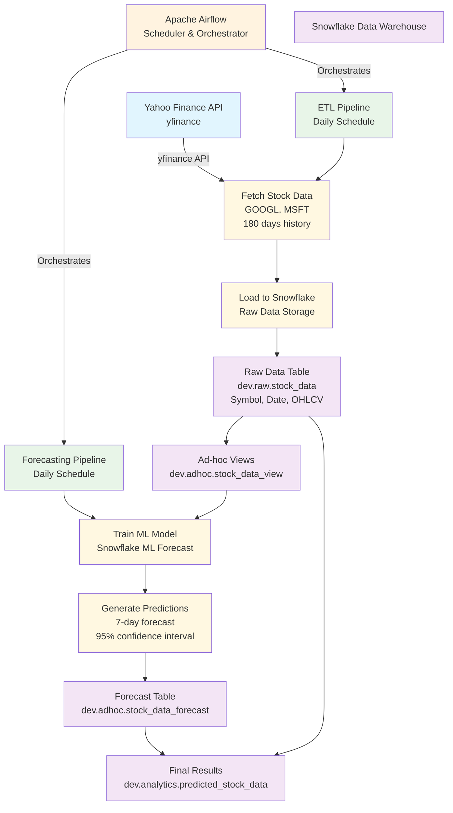

# Data Warehouse Lab 1

Hey there! 👋 This is Data Warehouse Lab 1 where we're building a cool stock price prediction system. 

Think of it as a smart assistant that watches Google and Microsoft stocks, learns from their past behavior, and tries to predict what might happen next week. Pretty neat, right?

## What We're Building

We're creating an automated system that:
- Grabs stock data from the internet (Google & Microsoft)
- Stores it safely in Snowflake (our data warehouse)
- Uses machine learning to predict future prices
- Runs everything automatically with Airflow

## System Architecture



## Pipeline Components

### ETL Pipeline
- **Schedule**: Daily execution via Apache Airflow
- **Data Source**: Yahoo Finance API (yfinance)
- **Stocks**: Google (GOOGL) and Microsoft (MSFT)
- **Data Period**: 180 days of historical data
- **Target**: Snowflake raw data table with OHLCV data

### Forecasting Pipeline  
- **Schedule**: Daily execution via Apache Airflow
- **ML Framework**: Snowflake ML Forecast
- **Prediction Horizon**: 7 days ahead
- **Confidence Interval**: 95%
- **Output**: Combined actual and predicted data with confidence bounds

### Data Warehouse Schema
- **Raw Layer**: `dev.raw.stock_data` - Historical stock data
- **Ad-hoc Layer**: Views and temporary forecast tables
- **Analytics Layer**: `dev.analytics.predicted_stock_data` - Final results with actuals and forecasts

## Files You'll Need

```
Stock_Price_Prediction/
├── etl_pipeline.py          # Gets the stock data and puts it in Snowflake
├── forecast_pipeline.py     # Makes predictions using ML
├── credentials_setup.md     # How to set up your Snowflake account
└── requirements.txt         # Python packages needed
```

## Getting Started

1. Set up your Snowflake credentials (check `credentials_setup.md`)
2. Install the Python packages: `pip install -r requirements.txt`
3. Copy the pipeline files to your Airflow setup
4. Let it run and watch the magic happen! ✨

That's it! The system will automatically fetch data daily and make predictions for the next 7 days. Pretty straightforward once you get your Snowflake account connected.

Happy coding! 🚀
# Stock_Price_Prediction
